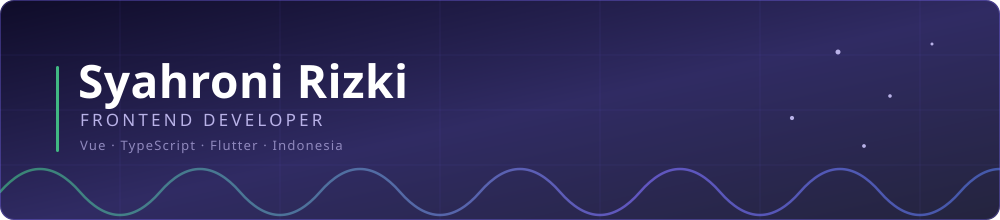
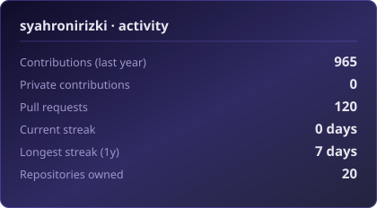
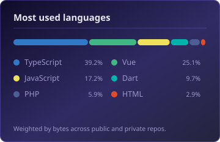

### Hi, I'm Roni 👋

I build the screens people actually have to use at work — the ones that get opened forty times a shift, on a cheap tablet, with one hand, in a hurry. Right now that means **healthcare software** at PT Nuansa Cerah Informasi, where a form that takes one tap too many is a real problem for a real nurse.

I care about the unglamorous half of frontend: does it survive a slow connection, does it fit a 375px screen, can you still read it at arm's length.

---

### 🔭 What I'm building

**A field checklist platform** — three codebases, one product:

| Piece | Stack | What it does |
|---|---|---|
| Web client | Vue 3 · Quasar · TypeScript | Scroll-locked data grids, offline-tolerant forms, card layouts that fold down for phones |
| API | TypeScript · Node.js | Submissions, scoring, photo validation |
| Mobile | Flutter · Dart | The same checklist, in the field, on Android |

Things I actually shipped there recently: a history page rebuilt so only the table scrolls and the rest of the UI stays put, status scoring unified across four views that had quietly drifted apart, and a card mode that replaces the table below 600px.

---

### 🧰 Tech I reach for

**Frontend**

       

**Mobile & backend**

    

**Tooling**

   

---

### 📊 By the numbers

 

> Most of my commits land in private client repos, so the public graph tells only part of the story. These cards are generated inside this repo by [a small script](scripts/gen_stats.py) on [a daily job](.github/workflows/stats.yml) — no third-party image service to go down on me.

---

### 🚀 Things worth a look

**[Signalbooth](https://github.com/syahronirizki/signalbooth-v2)** — a gesture-controlled VFX camera and photobooth that runs entirely in the browser. Throw a ✌️ and the lens goes soft; 👍 brings confetti and a combo counter. No server, no database — static files and `localStorage`. The interesting part is the language split: JavaScript owns the webcam and MediaPipe hand tracking, the only place a model that fast currently exists, while **Python running client-side via PyScript** does gesture interpretation, the VFX render loop, and all DOM work.

`Python` `JavaScript` `MediaPipe` `PyScript`

**[Meals App](https://github.com/syahronirizki/meals-app)** — Flutter app I'm using to push past the basics: navigation, state, filtering.

`Flutter` `Dart`

**[Sikest](https://github.com/syahronirizki/sikest)** — Sistem Informasi Kesehatan. My first proper look at how health data actually gets modelled, which is the problem space I ended up working in full time.

`PHP`

**[Portfolio](https://business-roni.vercel.app)** — where the more polished frontend work lives.

`React` `Tailwind` `Vercel`

---

### 🌱 Currently getting better at

- Making data-heavy Vue screens feel instant — virtual scroll, pagination, and knowing when neither is the answer
- Flutter beyond the tutorials
- Web accessibility, properly: focus order, contrast, screen-reader labels
- Writing the test that would have caught the bug, before the bug

---

### 🤝 Open to

Frontend work on Vue or Flutter, open-source UI components, and anything where somebody has to use the thing every single day. Also happy to look at a layout that isn't behaving on mobile — that's most of what I do.

---

### 📫 Reach me

 

---

🐛 Errors love me. Fine by me — every one I fix is one I'll recognise on sight next time.
